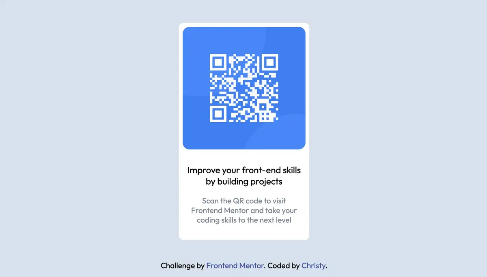

# Frontend Mentor - QR code component solution

This is a solution to the [QR code component challenge on Frontend Mentor](https://www.frontendmentor.io/challenges/qr-code-component-iux_sIO_H). Frontend Mentor challenges help you improve your coding skills by building realistic projects. 

## Table of contents

- [Overview](#overview)
  - [Screenshot](#screenshot)
  - [Links](#links)
- [My process](#my-process)
  - [Built with](#built-with)
  - [Continued development](#continued-development)
  - [Useful resources](#useful-resources)
- [Acknowledgments](#acknowledgments)

## Overview

### Screenshot

### Links

- [Code](https://github.com/christy313/fementor/tree/main/001-qr-code)
- [Live Demo](https://fementor-001-qr-code.netlify.app/)

## My process

### Built with

- HTML5
- CSS5
- Flexbox

### What I have learned

- Think about structure first

- Try to imagine the completed view in different view port 

- Accessibility

  - [Page should contain a level-one heading](https://dequeuniversity.com/rules/axe/4.3/page-has-heading-one?application=axeAPI)

- HTML Validations

  - The main element must not appear as a descendant of the section element.

### Continued development

Improve rwd above 1440px

### Useful resources

- [Color Converter](https://www.w3schools.com/colors/colors_converter.asp) - Covert Hsl to Hex color

## Acknowledgments

I would like to do mobile first and then go to the desktop.
