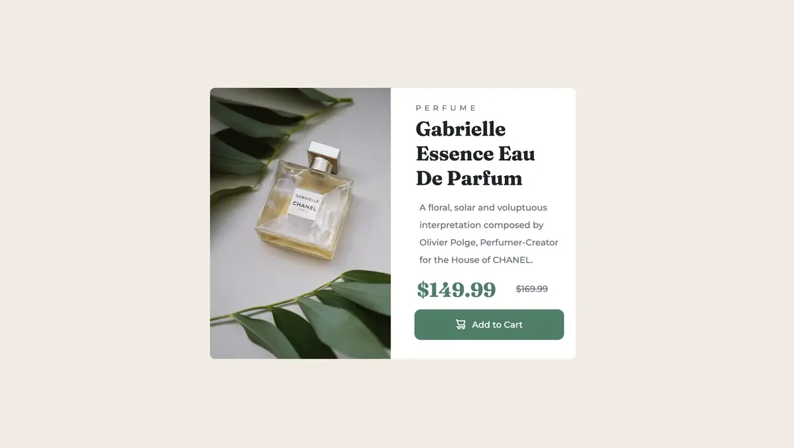

# Frontend Mentor - Product preview card component solution

This is a solution to the [Product preview card component challenge on Frontend Mentor](https://www.frontendmentor.io/challenges/product-preview-card-component-GO7UmttRfa). Frontend Mentor challenges help you improve your coding skills by building realistic projects. 

## Table of contents

- [Overview](#overview)
  - [The challenge](#the-challenge)
  - [Screenshot](#screenshot)
  - [Links](#links)
- [My process](#my-process)
  - [Built with](#built-with)
- [Acknowledgments](#acknowledgments)

## Overview

### The challenge

Users should be able to:

- View the optimal layout depending on their device's screen size
- See hover and focus states for interactive elements

### Screenshot

### What I have learned

- [HTML <picture> Element](https://www.w3schools.com/html/html_images_picture.asp)

  - The HTML <picture> element allows you to display different pictures for different devices or screen sizes.

- The class would be in the image tag 

### Links

- [Code](https://github.com/christy313/fementor/tree/main/002-product-preview)
- [Live Demo](https://fementor-002-product-review.netlify.app/)

## My process

### Built with

- Semantic HTML5 markup
- CSS custom properties
- Flexbox

## Acknowledgments

Started from 375px then go to 768px is a better choice.

